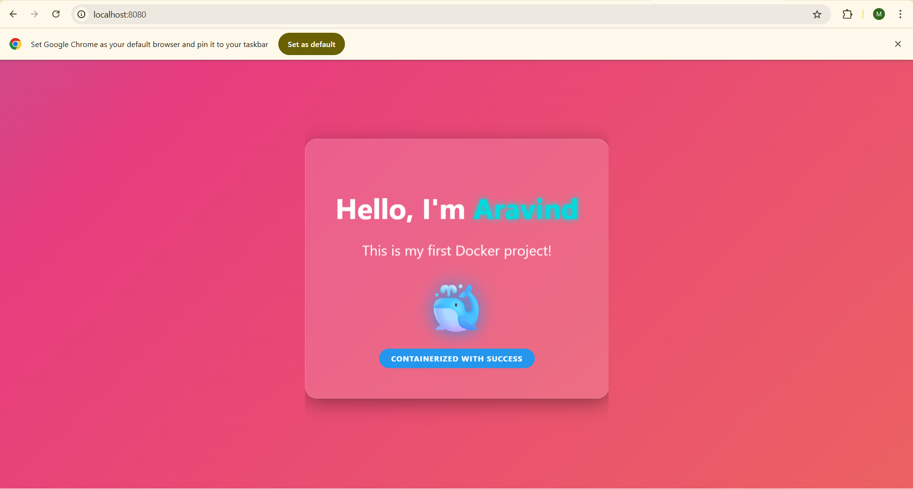
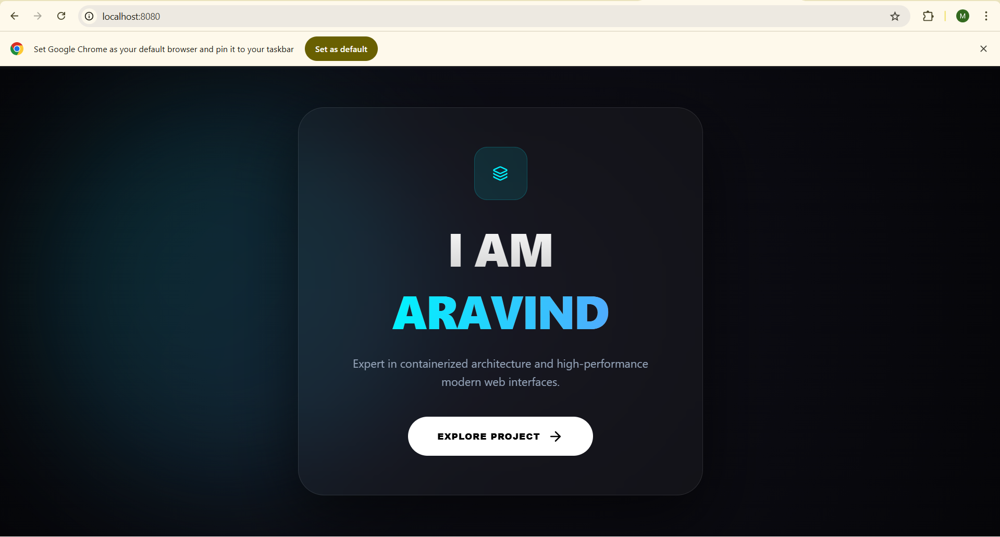

# 🚀 Modern Web Live-Sync with Docker

This project demonstrates a high-performance, modern developer portfolio for **ARAVIND**, served via a Dockerized Nginx environment with **Live Sync** capabilities.

---

## 🛠 Process Overview

* **Environment Setup**: Configured a local workspace in a WSL (Windows Subsystem for Linux) directory (`/mnt/d/Docker`).
* **Code Development**: Created a high-end, single-file `index.html` using Glassmorphism, Animated Mesh Gradients, and Lucide Icons.
* **Docker Integration**: Deployed an `nginx:alpine` container using **Bind Mounts (Volumes)** to bridge the local folder with the container's web directory.
* **Live Workflow**: Established a system where code changes update the browser output instantly upon refresh, eliminating the need for `docker build`.

---

## 💻 The "Master" Command

Run this command in your terminal to initialize the environment:

```bash
docker run -d --name web-aravind -p 8080:80 -v /mnt/d/Docker:/usr/share/nginx/html nginx:alpine```

## Commands Breakdown

-docker run: This is the primary command to create and start a new container from an image.
-d (Detached): This runs the container in the "background.
--name web-aravind: Assigns a custom name to your container.
- #Networking (Port Mapping)
-p 8080:80: This maps the Host Port to the Container Port.

-8080: The port you type into your browser (localhost:8080).
-80: The internal port the Nginx web server is listening on inside the container.
-v /mnt/d/Docker:/usr/share/nginx/html: This creates a Bind Mount (Volume).


## 🚀 Initial State (Before Sync)

In this state, the application is running the **stable version** of the code.  
The container has already been built and is serving the original UI.

🖼️   
**Figure 1.0 –** The application UI at initial launch (Port 8080).

### 🔍 What to Notice:
- 🧩 The header/text reflects the original code from `src/App.js`.
- 🔄 No manual refresh has been triggered yet.

---

## ⚡ Live Update (After Feature Addition)

After adding a new feature (for example, changing a button color or updating a heading) in the local IDE and saving the file, Docker automatically syncs the changes.

🖼️   
**Figure 1.1 –** The UI automatically updates with the **"New Feature"** header without a manual container rebuild.

### 🔄 The Transformation

- ⚡ **Instant Sync:**  
  The changes appear in the browser within milliseconds of saving the file.

- 🛠️ **No Manual Work:**  
  No `docker build` or `docker-compose up` commands were executed between the two screenshots.

- 🧠 **State Preservation:**  
  The application state (such as form inputs or counter values) remains intact during the update.


## 📝 Key Instructions
1. Ensure **Docker Desktop** is running on your Windows machine.
2. If port **8080** is already in use, change the first number in the \`-p\` command to \`9090\`.
3. To view the internal logs of the application, use:
   **"docker logs Web1"**

[← Back to Main Portfolio](../README.md)
